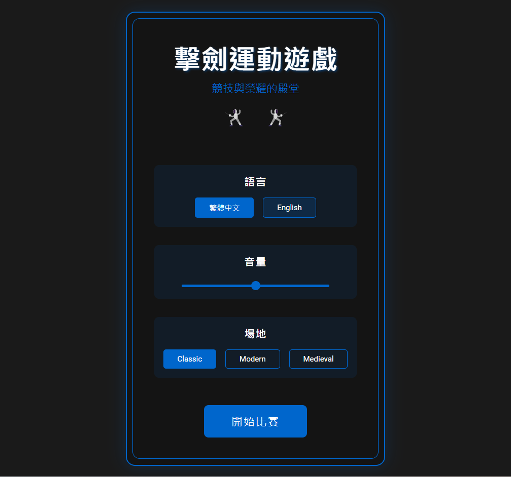
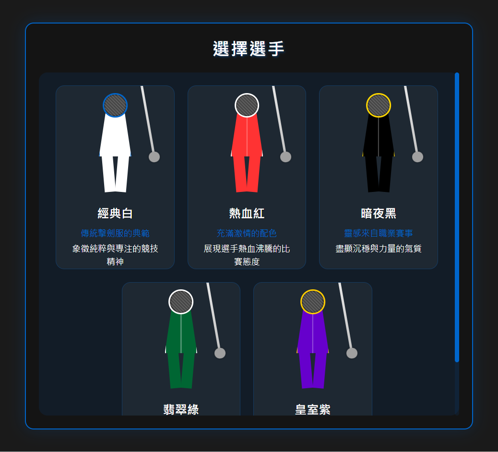
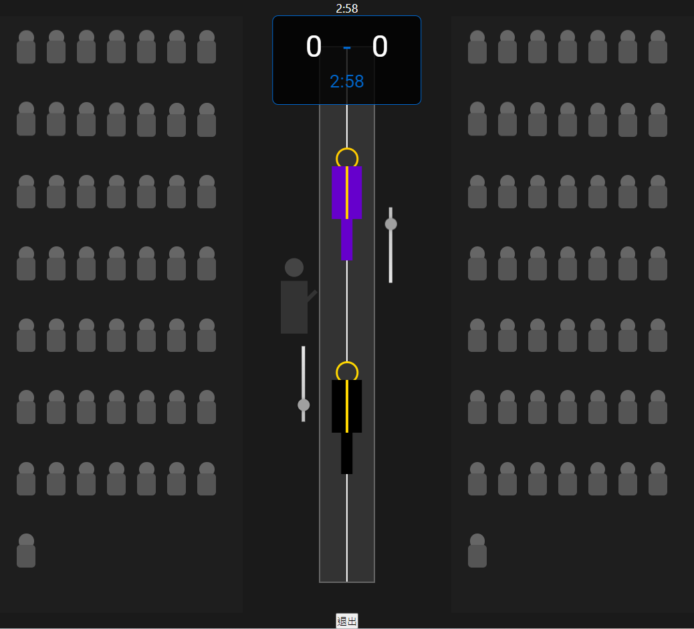
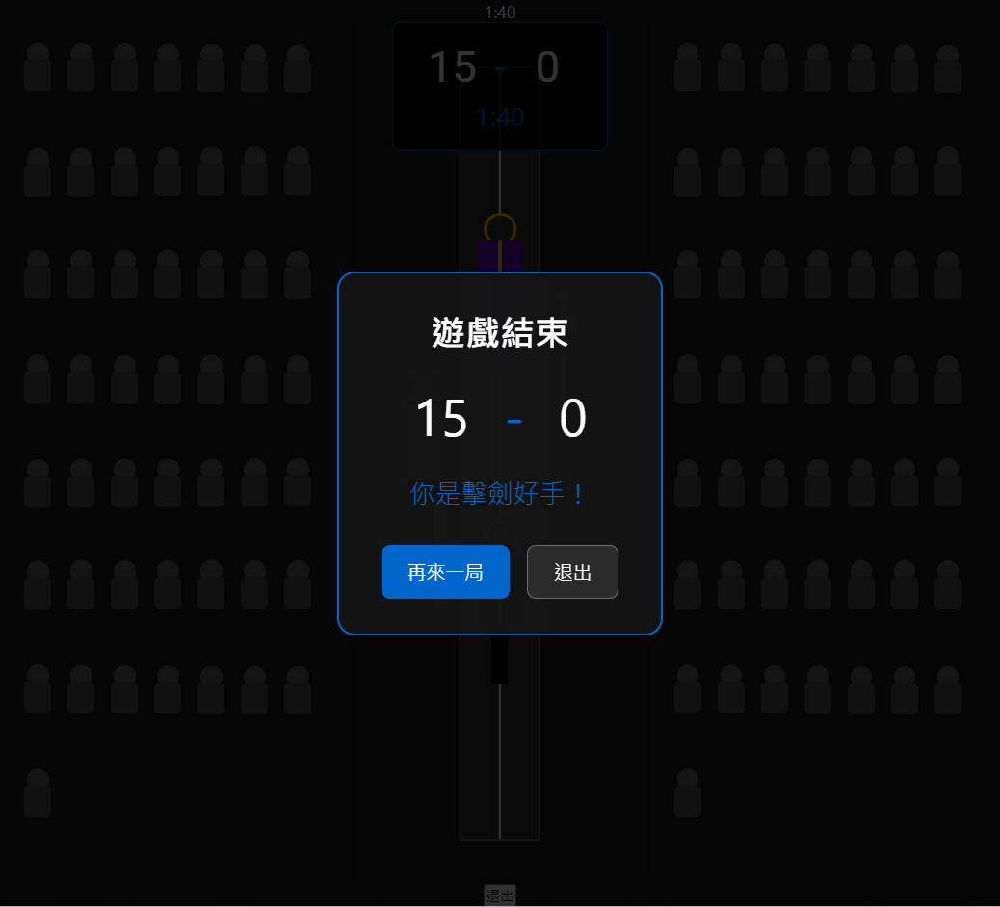

# 🤺 Fencing Game (擊劍遊戲)

  

這是一個使用 React + Vite 開發的 2D 擊劍遊戲。玩家可以體驗到基本的擊劍動作和對戰樂趣。

## ✨ 功能特點

- 🎮 基本的擊劍動作：前進、後退、刺擊
- 🎯 角色動畫效果
- 📊 計分系統
- 🤖 AI 對戰模式
- 👥 五種角色外觀選擇
- 🌍 多語言支援 (繁體中文/English)
- 🔊 音量控制
- 🏟️ 不同擊劍主題場景

## 🖼️ 遊戲截圖

  
  
  

## 🎮 遊戲流程

1. 🏁 開始選單

   - 語言選擇 (繁體中文/English)
   - 音量控制
   - 擊劍場景主題選擇
2. 👤 角色選擇

   - 五種不同膚色角色供選擇
   - AI 對手自動選擇
3. ⚔️ 戰鬥畫面

   - 即時對戰
   - 計分系統 (15分制)
   - 回合計時 (3分鐘)

## 🛠️ 技術棧

- ⚛️ React 18
- ⚡ Vite
- 📘 TypeScript
- 🎨 SCSS
- 🗃️ Zustand (狀態管理)
- 🌐 i18next (多語言)

## 🚀 開始使用

1. 克隆專案
